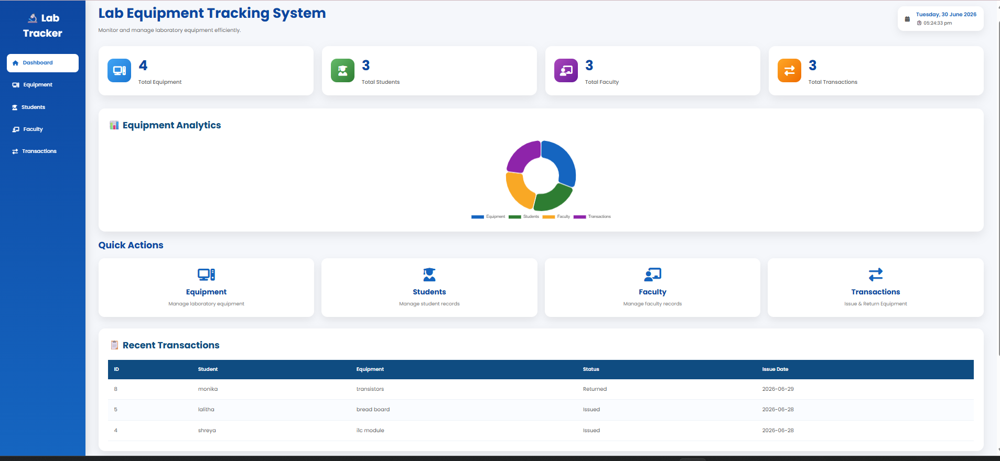
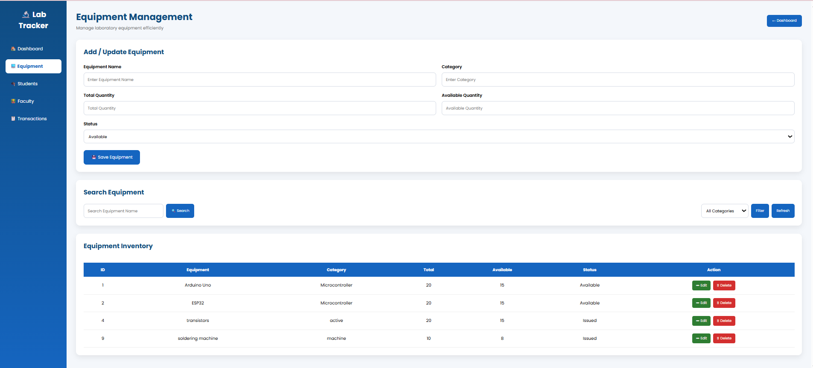
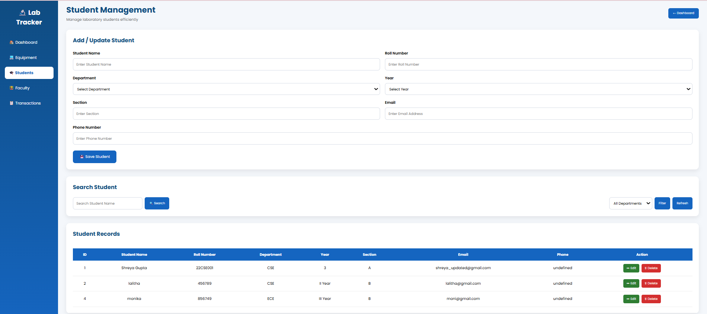
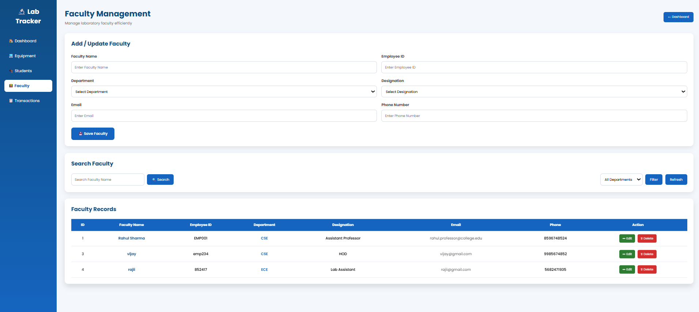
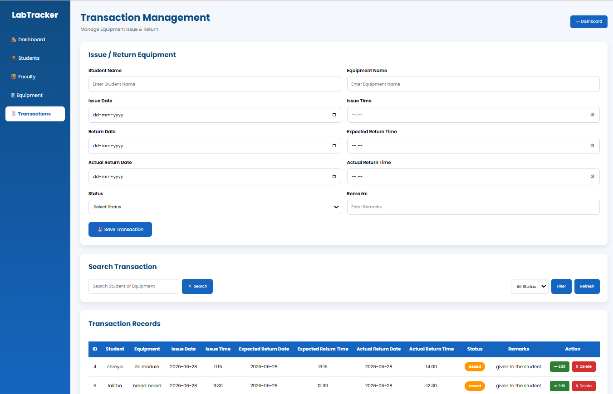

# 🚀 Lab Equipment Tracking System

A modern **Lab Equipment Tracking System** developed using **Spring Boot, MySQL, HTML, CSS, and JavaScript** to efficiently manage laboratory equipment, students, faculty, and equipment transactions.

---

## 📖 Overview

The Lab Equipment Tracking System is designed to simplify laboratory inventory management by allowing administrators to manage equipment, students, faculty, and issue/return transactions through a user-friendly web interface.

The system provides real-time statistics, analytics, and transaction history to improve equipment tracking and reduce manual record keeping.

---

## ✨ Features

### 📊 Dashboard

* Live dashboard statistics
* Equipment analytics chart
* Recent transactions
* Quick action shortcuts
* Live date & time
* Responsive design

### 💻 Equipment Management

* Add Equipment
* Update Equipment
* Delete Equipment
* Search Equipment
* Filter by Category
* Equipment Status

### 🎓 Student Management

* Add Student
* Edit Student
* Delete Student
* Search Student Records

### 👨‍🏫 Faculty Management

* Add Faculty
* Edit Faculty
* Delete Faculty
* Search Faculty Records

### 🔄 Transaction Management

* Issue Equipment
* Return Equipment
* Track Issue Date
* Expected Return Date
* Actual Return Date
* Transaction Status

### 🎨 User Interface

* Modern Dashboard
* Responsive Layout
* Interactive Charts
* Toast Notifications
* Professional Navigation Sidebar

---

# 🛠️ Technologies Used

### Backend

* Spring Boot
* Spring MVC
* Spring Data JPA
* Hibernate

### Frontend

* HTML5
* CSS3
* JavaScript
* Thymeleaf

### Database

* MySQL

### Tools

* Spring Tool Suite (STS)
* VS Code
* Postman
* Git
* GitHub

---

# 📂 Project Structure

```text
lab-equipment-tracker
│
├── src
│   ├── main
│   │   ├── java
│   │   ├── resources
│   │   │   ├── static
│   │   │   ├── templates
│   │   │   └── application.properties
│   │
│   └── test
│
├── pom.xml
├── mvnw
└── README.md
```

---

# 🚀 How to Run

### 1. Clone the repository

```bash
git clone https://github.com/shreyan1790/LabEquipmentTracker1.git
```

### 2. Open the project

Import the project into **Spring Tool Suite (STS)** as an Existing Maven Project.

### 3. Configure MySQL

Create a database named:

```sql
lab_equipment_tracker
```

Update the database credentials in:

```properties
application.properties
```

### 4. Run the application

Start the Spring Boot application.

Open:

```
http://localhost:8000
```

---

# 📊 Future Enhancements

* RFID Integration
* ESP32 Integration
* QR Code Support
* Email Notifications
* Equipment Maintenance Tracking
* Cloud Deployment

---

# 👩‍💻 Author

**Shreya Gupta**

Computer Science Engineering Student

---

# ⭐ Repository

If you found this project useful, consider giving it a ⭐ on GitHub.


# 📸 Application Screenshots

## 🏠 Dashboard



## 💻 Equipment Management



## 🎓 Student Management



## 👨‍🏫 Faculty Management



## 🔄 Transaction Management

